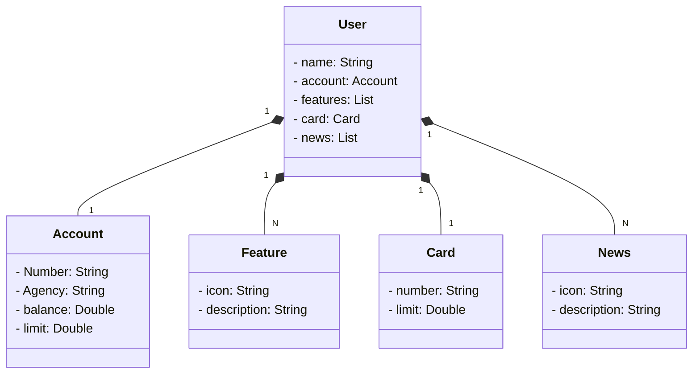

# API Java do Santander Dev Week
Java RESTful API criada para a Santander Dev Week construída em Java 17 com Spring Boot 3.

# Principais Tecnologia

- Java 17 : Utilizaremos a versão LTS mais recente do Java para tirar vantagem das inovações que essa linguagem robusta e amplamente utilizada oferece;

- Spring Boot 3 : Trabalharemos com a mais nova versão do Spring Boot, que maximiza a produtividade do desenvolvedor por meio de suas poderosas metas de autoconfiguração;

- Spring Data JPA : Exploraremos como essa ferramenta pode simplificar nossa camada de acesso aos dados, facilitando a integração com bancos de dados SQL;

- OpenAPI (Swagger) : Vamos criar uma documentação de API eficaz e fácil de entender usando OpenAPI (Swagger), perfeitamente alinhada com a alta produtividade que o Spring Boot oferece;

- Ferrovia : facilita a implantação e monitoramento de nossas soluções na nuvem, além de oferecer diversos bancos de dados como serviço e pipelines de CI/CD.

## [LINK DO FIGMA](https://www.figma.com/file/0ZsjwjsYlYd3timxqMWlbj/SANTANDER---Projeto-Web%2FMobile?type=design&node-id=1421-432&mode=design)

O Figma foi utilizado para a abstração do domínio desta API, sendo útil na análise e projeto da solução.

## Diagram de Classes

